# Omarchy Neon Glow — Mobile Wallpapers

Glowing Omarchy wallpapers for mobile screens, now in ten color variants. Each has a nearly black background and room above the design for a clock or widgets.

Companion wallpapers to the [Neon Glow Omarchy theme](https://github.com/ejuro/omarchy-neon-glow-theme).

## Preview

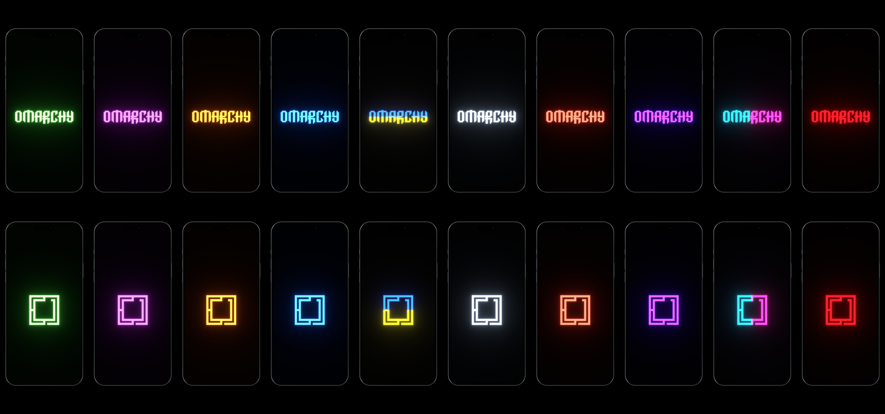

## Colors

Each color shows the wordmark first and the logo below it. Choose a preview to open that color’s downloads.

<table>
  <tr>
    <th width="20%" align="center"><a href="wallpapers/emerald/README.md">Emerald</a></th>
    <th width="20%" align="center"><a href="wallpapers/orchid/README.md">Orchid</a></th>
    <th width="20%" align="center"><a href="wallpapers/gold/README.md">Gold</a></th>
    <th width="20%" align="center"><a href="wallpapers/blue/README.md">Blue</a></th>
    <th width="20%" align="center"><a href="wallpapers/blue-yellow/README.md">Blue &amp; yellow</a></th>
  </tr>
  <tr>
    <td width="20%" align="center"><a href="wallpapers/emerald/README.md">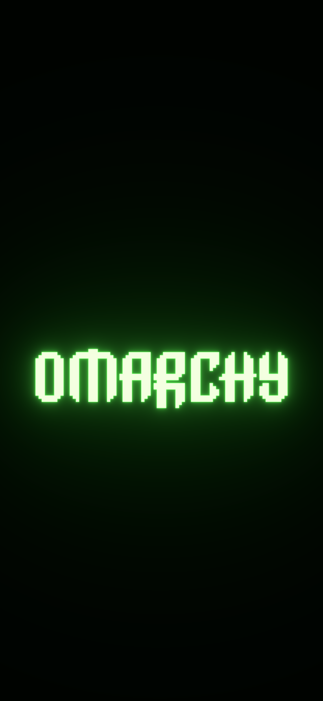</a></td>
    <td width="20%" align="center"><a href="wallpapers/orchid/README.md">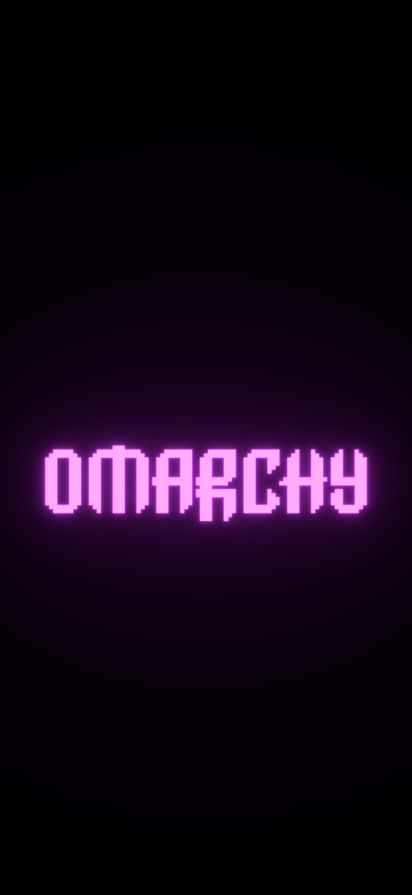</a></td>
    <td width="20%" align="center"><a href="wallpapers/gold/README.md">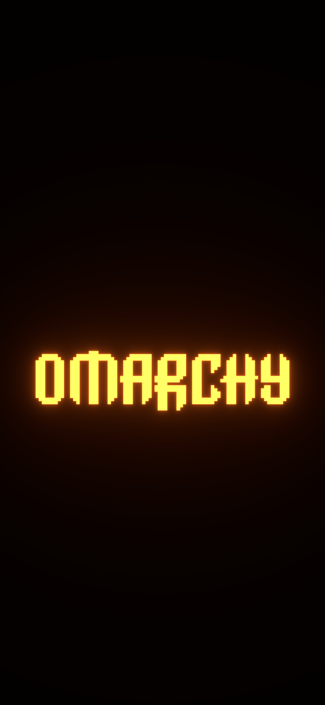</a></td>
    <td width="20%" align="center"><a href="wallpapers/blue/README.md">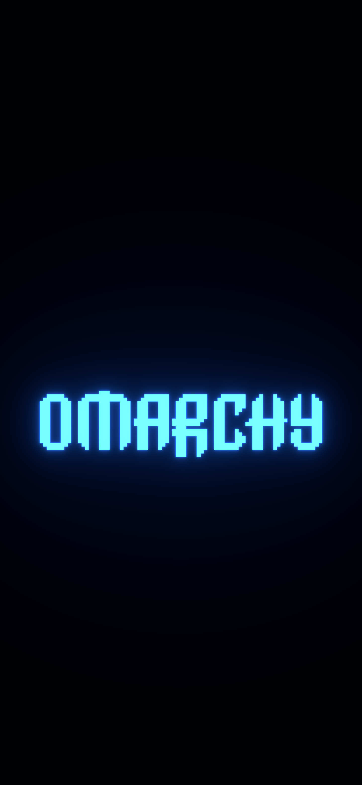</a></td>
    <td width="20%" align="center"><a href="wallpapers/blue-yellow/README.md">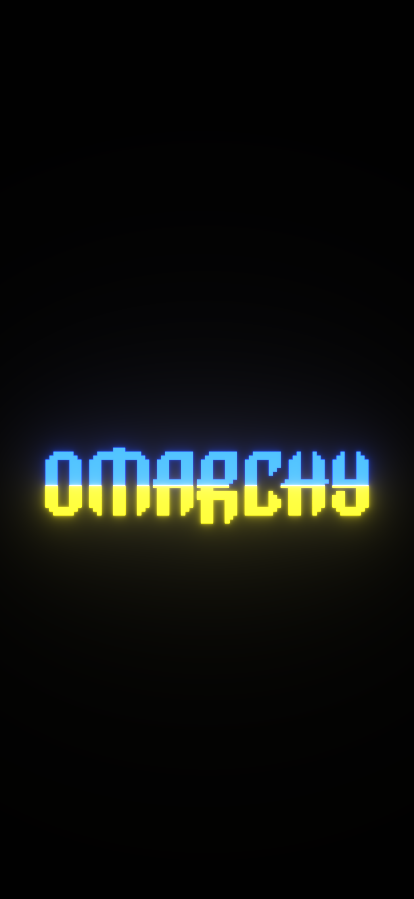</a></td>
  </tr>
  <tr>
    <td width="20%" align="center"></td>
    <td width="20%" align="center"><a href="wallpapers/orchid/README.md">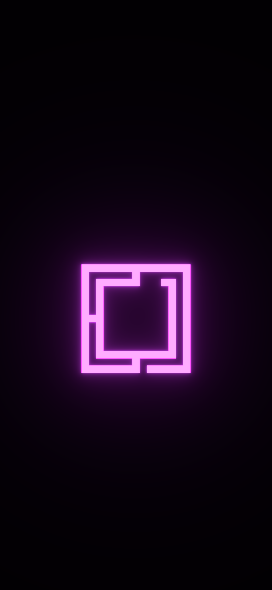</a></td>
    <td width="20%" align="center"><a href="wallpapers/gold/README.md">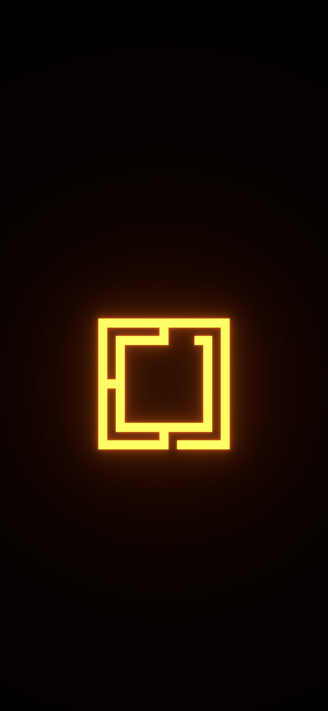</a></td>
    <td width="20%" align="center"><a href="wallpapers/blue/README.md">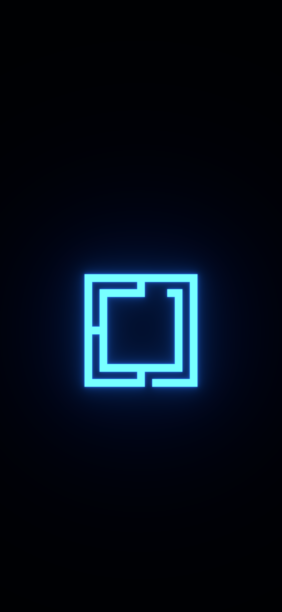</a></td>
    <td width="20%" align="center"><a href="wallpapers/blue-yellow/README.md">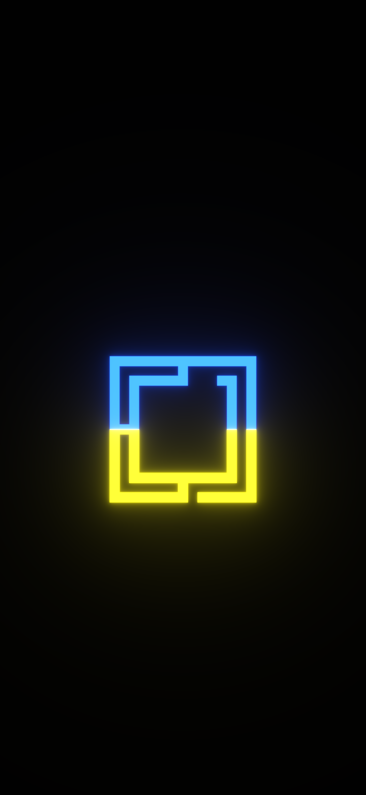</a></td>
  </tr>
  <tr>
    <th width="20%" align="center"><a href="wallpapers/ice-white/README.md">Ice white</a></th>
    <th width="20%" align="center"><a href="wallpapers/hot-coral/README.md">Hot coral</a></th>
    <th width="20%" align="center"><a href="wallpapers/ultraviolet/README.md">Ultraviolet</a></th>
    <th width="20%" align="center"><a href="wallpapers/cyberpunk/README.md">Cyberpunk</a></th>
    <th width="20%" align="center"><a href="wallpapers/ruby-red/README.md">Ruby red</a></th>
  </tr>
  <tr>
    <td width="20%" align="center"><a href="wallpapers/ice-white/README.md">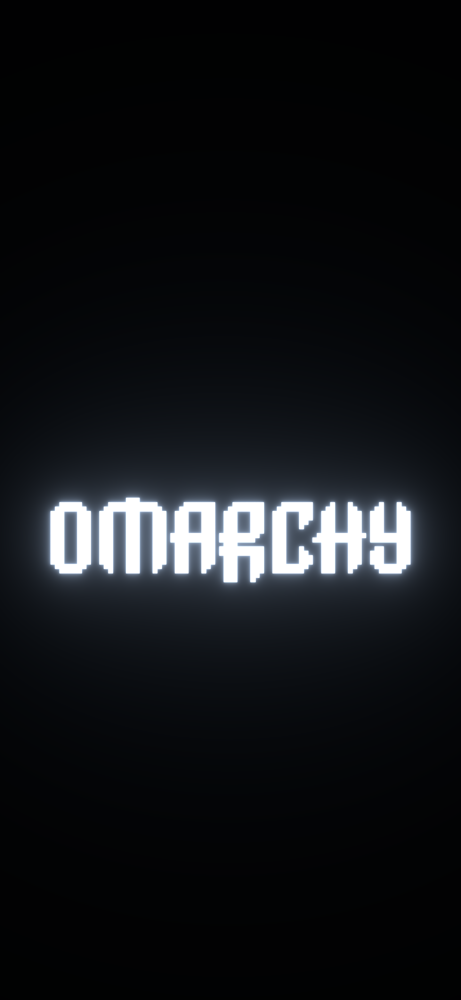</a></td>
    <td width="20%" align="center"></td>
    <td width="20%" align="center"><a href="wallpapers/ultraviolet/README.md">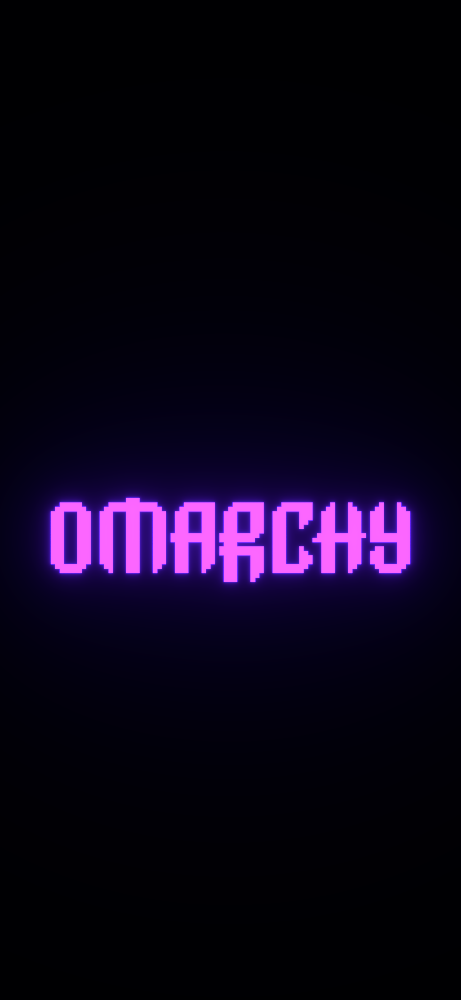</a></td>
    <td width="20%" align="center"><a href="wallpapers/cyberpunk/README.md">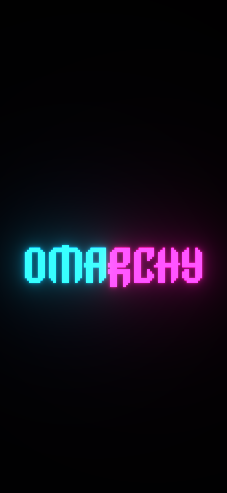</a></td>
    <td width="20%" align="center"><a href="wallpapers/ruby-red/README.md">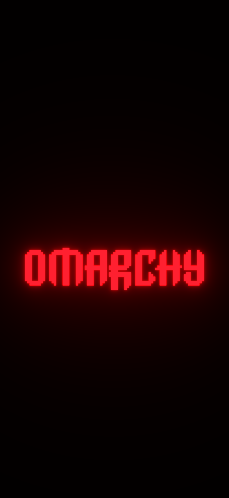</a></td>
  </tr>
  <tr>
    <td width="20%" align="center"><a href="wallpapers/ice-white/README.md">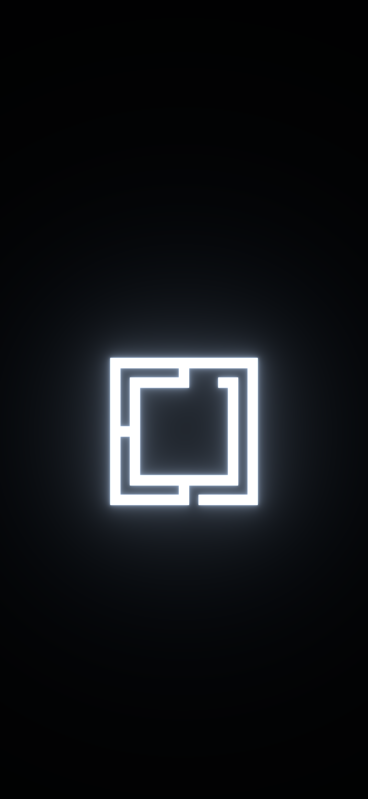</a></td>
    <td width="20%" align="center"><a href="wallpapers/hot-coral/README.md">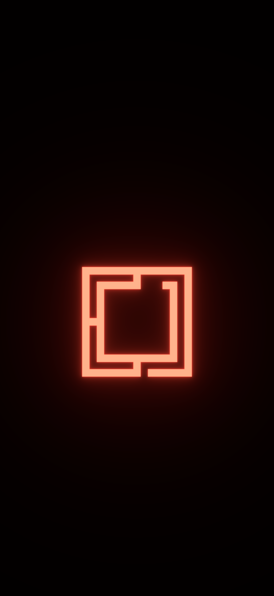</a></td>
    <td width="20%" align="center"><a href="wallpapers/ultraviolet/README.md">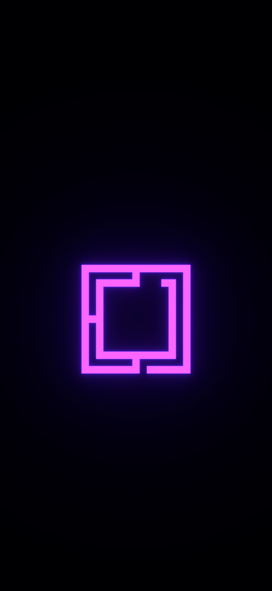</a></td>
    <td width="20%" align="center"><a href="wallpapers/cyberpunk/README.md">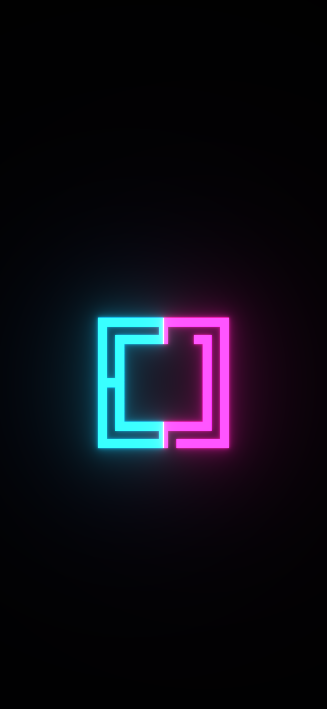</a></td>
    <td width="20%" align="center"><a href="wallpapers/ruby-red/README.md">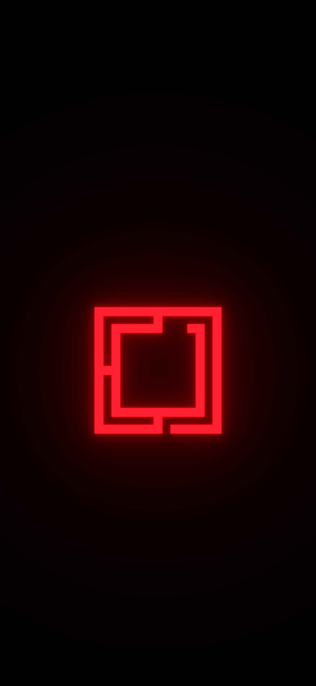</a></td>
  </tr>
</table>

## Sizes and use

60 high-resolution, 16-bit RGB PNGs: ten colors, two designs, and three sizes per design.

| Aspect ratio | Resolution |
| --- | --- |
| 9:16 | 1440 × 2560 |
| 9:19.5 | 1440 × 3120 |
| 9:20 | 1440 × 3200 |

Choose the aspect ratio closest to your screen, open the image from its color page, save the original PNG, and set it as your wallpaper. Both designs sit slightly below center. Your phone's wallpaper picker may apply additional zoom or cropping.

The original neon geometry and bloom are preserved, with no floor or added grain. Wallpapers are organized under `wallpapers/<color>/`, with a preview and download index in each color folder.

## Credits and license

Wallpapers by Erik Johansson, featuring the [Omarchy](https://omarchy.org/) logo and wordmark.

[MIT](LICENSE). Copyright (c) 2026 Erik Johansson.
