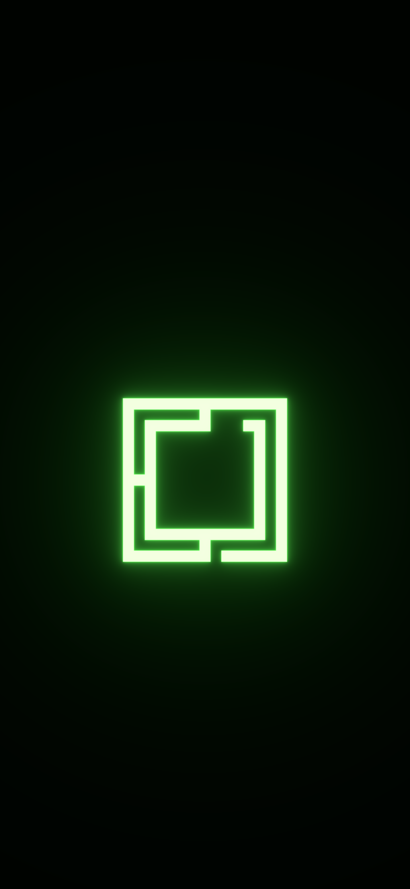

# Emerald Glow — Mobile

Glowing green Omarchy wallpapers for mobile screens, with a nearly black background and room above the design for a clock or widgets.

Companion wallpapers to the [Emerald Glow Omarchy theme](https://github.com/ejuro/omarchy-emerald-glow-theme).

## Preview

## Wallpapers

Six high-resolution, 16-bit RGB PNGs. Choose the aspect ratio closest to your screen, download the image, and set it as your wallpaper.

| Aspect ratio | Resolution | Wordmark | Logo |
| --- | --- | --- | --- |
| 9:16 | 1440 × 2560 | [Download](wallpapers/emerald-glow-wordmark-mobile-1440x2560.png) | [Download](wallpapers/emerald-glow-logo-mobile-1440x2560.png) |
| 9:19.5 | 1440 × 3120 | [Download](wallpapers/emerald-glow-wordmark-mobile-1440x3120.png) | [Download](wallpapers/emerald-glow-logo-mobile-1440x3120.png) |
| 9:20 | 1440 × 3200 | [Download](wallpapers/emerald-glow-wordmark-mobile-1440x3200.png) | [Download](wallpapers/emerald-glow-logo-mobile-1440x3200.png) |

Both designs sit slightly below center. The original neon geometry and bloom are preserved, with no floor or added grain. Your phone's wallpaper picker may apply additional zoom or cropping.

## Credits and license

Wallpapers by Erik Johansson, featuring the [Omarchy](https://omarchy.org/) logo and wordmark.

[MIT](LICENSE). Copyright (c) 2026 Erik Johansson.
